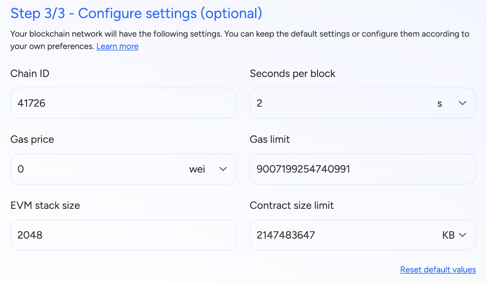

import { Tabs, Tab } from "fumadocs-ui/components/tabs";
import { Callout } from "fumadocs-ui/components/callout";
import { Steps } from "fumadocs-ui/components/steps";
import { Card } from "fumadocs-ui/components/card";

## Prerequisites

Before setting up a blockchain network, you need to have an application created
in your workspace. Applications provide the organizational context for all your
blockchain resources including networks, nodes, and development tools.

If you haven't created an application yet, follow our
[Create an Application](../building-with-settlemint/create-an-application) guide
first.

## How to Add a Blockchain Network

For EVM Chains, SettleMint offers Hyperledger Besu and Quorum for permissioned networks and a bunch of public networks to choose from. 


<Tabs items={['Platform UI', 'SDK CLI', 'SDK JS']}>

  <Tab value="Platform UI">
    <div className="leading-tight">
      <h3 className="mb-1">Navigate to Application</h3>
      <p>Navigate to the <strong>application</strong> where you will create the network.</p>

      <h3 className="mb-1">Add Network</h3>
      <p>Click <strong>Add blockchain network</strong> to open a form.</p>

      <h3 className="mb-1">Configure Network</h3>
      <ol className="list-decimal list-inside leading-tight">
        <li><strong>Select the protocol</strong> of your choice and click <strong>Continue</strong>.</li>
        <li>Choose a <strong>network name</strong> and a <strong>node name</strong>.</li>
        <li>Configure your deployment settings and network parameters.</li>
        <li>Click <strong>Confirm</strong> to add the network.</li>
      </ol>
    </div>
  </Tab>

  <Tab value="SDK CLI">
    First ensure you're authenticated:
    ```bash
    settlemint login
    ```

    Create a blockchain network:
    ```bash
    settlemint platform create blockchain-network besu <network-name> \
      --node-name <node-name>

    # Get information about the command and all available options
    settlemint platform create blockchain-network besu --help
    ```
  </Tab>

  <Tab value="SDK JS">
    ```typescript
    import { createSettleMintClient } from '@settlemint/sdk-js';

    const client = createSettleMintClient({
      accessToken: 'your_access_token',
      instance: 'https://console.settlemint.com'
    });

    // Create network
    const createNetwork = async () => {
      const result = await client.blockchainNetwork.create({
        applicationUniqueName: "your-app",
        name: "my-network",
        nodeName: "validator-1",
        consensusAlgorithm: "BESU_QBFT",
        provider: "GKE", // GKE, EKS, AKS
        region: "EUROPE"
      });
      console.log('Network created:', result);
    };

    // List networks
    const listNetworks = async () => {
      const networks = await client.blockchainNetwork.list("your-app");
      console.log('Networks:', networks);
    };

    // Get network details
    const getNetwork = async () => {
      const network = await client.blockchainNetwork.read("network-unique-name");
      console.log('Network details:', network);
    };

    // Delete network
    const deleteNetwork = async () => {
      await client.blockchainNetwork.delete("network-unique-name");
    };

    // Restart network
    const restartNetwork = async () => {
      await client.blockchainNetwork.restart("network-unique-name");
    };
    ```

    <Callout type="tip">
    Get your access token from the Platform UI under User Settings → API Tokens.
    </Callout>

  </Tab>

</Tabs>

For EVM Chains, SettleMint allows you to set key genesis file paramters for a custom network configuration. 



## Manage a Network

<Tabs items={['Platform UI', 'SDK CLI', 'SDK JS']}>
  <Tab value="Platform UI">

    Navigate to your network and click **Manage network** to see available actions:
    - View network details and status
    - Monitor network health
    - Restart network operations

  </Tab>

  <Tab value="SDK CLI">
    ```bash
    # List networks
    settlemint platform list blockchain-networks --application <app-name>

    # Get network details
    settlemint platform read blockchain-network <network-name>

    # Delete network
    settlemint platform delete blockchain-network <network-name>

    # Restart network
    settlemint platform restart blockchain-network <network-name>
    ```

  </Tab>

  <Tab value="SDK JS">
    ```typescript
    // List networks
    await client.blockchainNetwork.list("your-app");

    // Get network details
    await client.blockchainNetwork.read("network-unique-name");

    // Delete network
    await client.blockchainNetwork.delete("network-unique-name");

    // Restart network
    await client.blockchainNetwork.restart("network-unique-name");
    ```

  </Tab>
</Tabs>


When we deploy a network, first node is automatically deployed with it and is a validator node. Once you have deployed a permissioned network or joined a public network, you
can add more nodes to it. 

<div className="grid grid-cols-1 md:grid-cols-2 gap-6 mb-8">
  <Card>
    ### Node Types
    - Validator nodes
    - Non-validator nodes
    - Archive nodes
    - Light nodes
  </Card>

  <Card>
    ### Key Features
    - Custom configurations
    - Resource management
    - Performance monitoring
    - Health checks
  </Card>
</div>

## Add Node

<Tabs items={['Platform UI', 'SDK CLI', 'SDK JS']}>

  <Tab value="Platform UI">
    <div className="leading-tight">
      <h3 className="mb-1">Navigate to Application</h3>
      <p>Go to the application containing your network.</p>

      <h3 className="mb-1">Access Nodes</h3>
      <p>Click <strong>Blockchain nodes</strong> in the left navigation.</p>

      <h3 className="mb-1">Configure Node</h3>
      <ol className="list-decimal list-inside leading-tight">
        <li>Click <strong>Add a blockchain node</strong>.</li>
        <li>Select the blockchain network to add this node to.</li>
        <li>Choose a <strong>node name</strong> and <strong>node type</strong> (Validator/Non-Validator).</li>
        <li>Configure deployment settings.</li>
        <li>Click <strong>Confirm</strong>.</li>
      </ol>
    </div>
  </Tab>

  <Tab value="SDK CLI">
    First ensure you're authenticated:
    ```bash
    settlemint login
    ```

    Create a blockchain node:
    ```bash
    settlemint platform create blockchain-node besu <node-name> \
      --blockchain-network <network-name> \
      --node-type <VALIDATOR|NON_VALIDATOR> \
      --provider <provider> \
      --region <region>

    # Get help
    settlemint platform create blockchain-node --help
    ```
  </Tab>

  <Tab value="SDK JS">
    ```typescript
    import { createSettleMintClient } from '@settlemint/sdk-js';

    const client = createSettleMintClient({
      accessToken: 'your_access_token',
      instance: 'https://console.settlemint.com'
    });

    const createNode = async () => {
      const result = await client.blockchainNode.create({
        applicationUniqueName: "your-application",
        blockchainNetworkUniqueName: "your-network",
        name: "my-node",
        nodeType: "VALIDATOR",
        provider: "provider",
        region: "region"
      });
      console.log('Node created:', result);
    };
    ```

    <Callout type="tip">
    Get your access token from the Platform UI in left menu bar > Access Tokens.
    </Callout>

  </Tab>

</Tabs>

## Manage Node

<Tabs items={['Platform UI', 'SDK CLI', 'SDK JS']}>
  <Tab value="Platform UI">
    Navigate to your node and click **Manage node** to see available actions:
    - View node details and status
    - Monitor node health
    - Restart node operations
  </Tab>

  <Tab value="SDK CLI">
    ```bash
    # List nodes
    settlemint platform list services --application <application-name>

    # Restart node
    settlemint platform restart blockchain-node <node-name>
    ```

  </Tab>

  <Tab value="SDK JS">
    ```typescript
    // List nodes
    await client.blockchainNode.list("your-application");

    // Get node details
    await client.blockchainNode.read("node-unique-name");

    // Restart node
    await client.blockchainNode.restart("node-unique-name");
    ```

  </Tab>
</Tabs>

<Callout type="info">
  All operations require appropriate permissions in your workspace.
</Callout>
