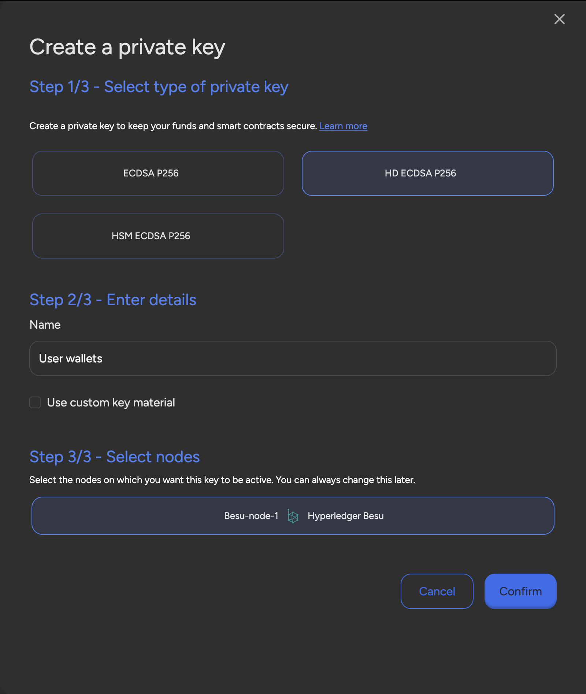
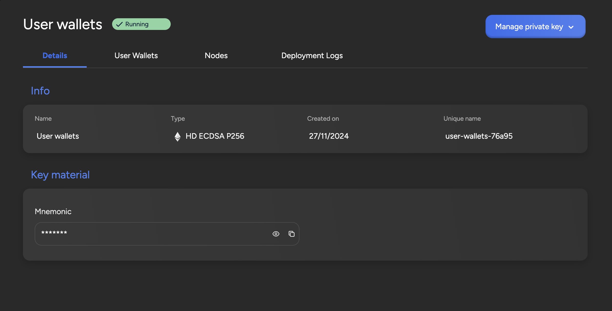
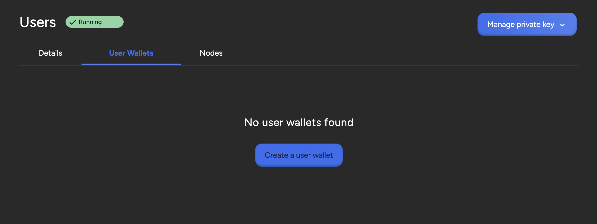
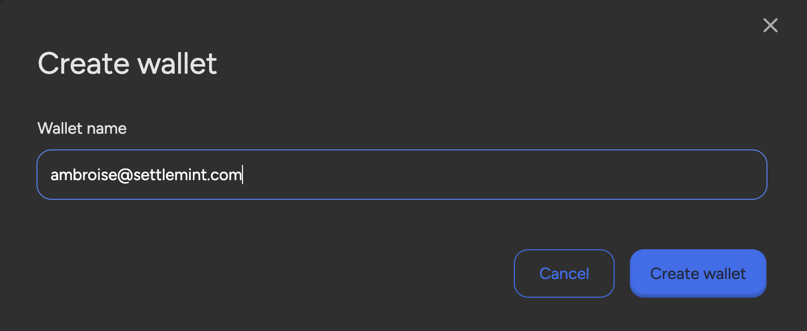
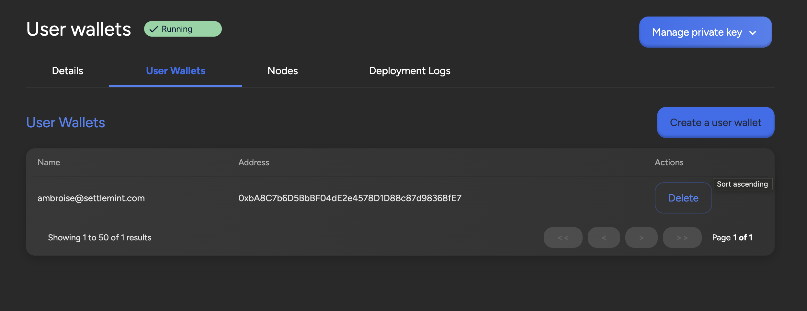

import { Tabs, Tab } from "fumadocs-ui/components/tabs";
import { Callout } from "fumadocs-ui/components/callout";
import { Steps } from "fumadocs-ui/components/steps";
import { Card } from "fumadocs-ui/components/card";

## How to add private keys and user wallets in SettleMint platform

# Private Keys

To send transactions to a blockchain network, you need a private key to sign
these transactions, and the private key should contain enough funds to cover the
gas price for the transaction.

You can sign transactions with private keys you created outside SettleMint with
e.g. MetaMask or other wallet solutions. SettleMint however provides an option
to **create and manage private keys within the platform**.

When you deploy a blockchain node it contains a signing proxy that captures the
eth_sendTransaction call, uses the appropriate key from the private key section
to sign it, and sends it onwards to the blockchain node. You can use this proxy
directly via the nodes JSON-RPC endpoints
([https://eth.wiki/json-rpc/API](https://eth.wiki/json-rpc/API)) and via tools
like Hardhat
([https://hardhat.org/config/#json-rpc-based-networks](https://hardhat.org/config/#json-rpc-based-networks))
configured to use the "remote" default option for signing.

## Create a private key

<Tabs items={['Platform UI', 'SDK CLI', 'SDK JS']}>
  <Tab value="Platform UI">
    Navigate to your **application**, click **Private keys** in the left navigation, and then click **Create a private key**. This opens a form.

    Follow these steps to create the private key:

    1. Choose a **private key type**:
       - **Accessible ECDSA P256**: Standard Ethereum-style private keys with exposed mnemonic
       - **HD ECDSA P256**: Hierarchical Deterministic keys for advanced key management
       - **HSM ECDSA P256**: Hardware Security Module protected keys for maximum security

    2. Choose a **name** for your private key
    3. Select the **nodes** on which you want the key to be active
    4. Click **Confirm** to create the key

  </Tab>
  
  <Tab value="SDK CLI">
    ```bash
    # Create Accessible ECDSA P256 key
    settlemint platform create private-key accessible-ecdsa-p256 my-key \
      --application my-app \
      --blockchain-node node-123

    # Create HD ECDSA P256 key
    settlemint platform create private-key hd-ecdsa-p256 my-key \
      --application my-app

    # Create HSM ECDSA P256 key
    settlemint platform create private-key hsm-ecdsa-p256 my-key \
      --application my-app
    ```

  </Tab>
  
  <Tab value="SDK JS">
    ```typescript
    import { createSettleMintClient } from '@settlemint/sdk-js';

    const client = createSettleMintClient({
      accessToken: 'your_access_token',
      instance: 'https://console.settlemint.com'
    });

    // Create private key
    const createKey = async () => {
      const result = await client.privateKey.create({
        name: "my-key",
        applicationUniqueName: "my-app",
        privateKeyType: "ACCESSIBLE_ECDSA_P256", // or "HD_ECDSA_P256" or "HSM_ECDSA_P256"
        blockchainNodeUniqueNames: ["node-123"] // optional
      });
      console.log('Private key created:', result);
    };
    ```

  </Tab>
</Tabs>

## Manage private keys

<Tabs items={['Platform UI', 'SDK CLI', 'SDK JS']}>
  <Tab value="Platform UI">
    1. Navigate to your application's **Private keys** section
    2. Click on a private key to:
       - View details and status
       - Manage node associations
       - Check balances
       - Fund the key
  </Tab>
  
  <Tab value="SDK CLI">
    ```bash
    # List all private keys
    settlemint platform list private-keys --application <app-name>

    # View specific key details
    settlemint platform read private-key <private-key-unique-name>

    # Restart a private key
    settlemint platform restart private-key <private-key-unique-name>
    ```

  </Tab>
  
  <Tab value="SDK JS">
    ```typescript
    // List private keys
    const listKeys = async () => {
      const keys = await client.privateKey.list("your-app-name");
    };

    // Get key details
    const getKey = async () => {
      const key = await client.privateKey.read("key-unique-name");
    };

    // Restart key
    const restartKey = async () => {
      await client.privateKey.restart("key-unique-name");
    };
    ```

  </Tab>
</Tabs>

## Fund the private key

For networks that require gas to perform a transaction, your private key should
contain enough funds to cover the gas price.

1. Click the **private key** in the overview to see detailed information
2. Open the **Balances tab**
3. Click **Fund**
4. Scan the **QR code** with your wallet/exchange to fund the key

<Callout type="info">
  Ensure your private key has sufficient funds before attempting transactions on
  networks that require gas fees.
</Callout>


## User Wallets

SettleMint's **User Wallets** feature offers a production-ready solution for
managing infinite wallets with efficiency and scalability. This tool empowers
users with seamless wallet generation, ensuring **cost-effective management**
and eliminating additional expenses. By generating **unique addresses for each
user**, privacy is significantly enhanced, while improved performance ensures
faster, parallel transaction processing through separate nonces. User wallet
also simplifies wallet recovery since all wallets are derived from a single
master key. User wallets use the same signing proxy to sign transactions with
the corresponding user private key.

## Set up User Wallets

To set up your user wallets, navigate to your application, click **Private
keys** in the left navigation, and then click **Create a private key**. This
opens a form.

Select **HD ECDSA P256** as the private key type then, enter a **name** for your
deployment. You can also select the nodes or load balancers on which you want to
enable the user wallets. You can change this later if you want to use your user
wallets on a different node. Click **Confirm** to deploy the wallet.



## Create User Wallets

When your deployment status is **Running**, you can click on it to check the
details. You can see the Mnemonic from which the user wallets are generated
under **Key material**.



Upon initialization, the User Wallets section is empty. To create your first
user wallet, click on **Create a user wallet**.



This opens a form in which you must enter a wallet name.



The new user wallet appears in the list.



You can now see the address associated with that user. Remember that for
networks that require gas to perform a transaction, the user wallet should
contain enough funds to cover the gas price. You can fund it using the address
displayed in the list.