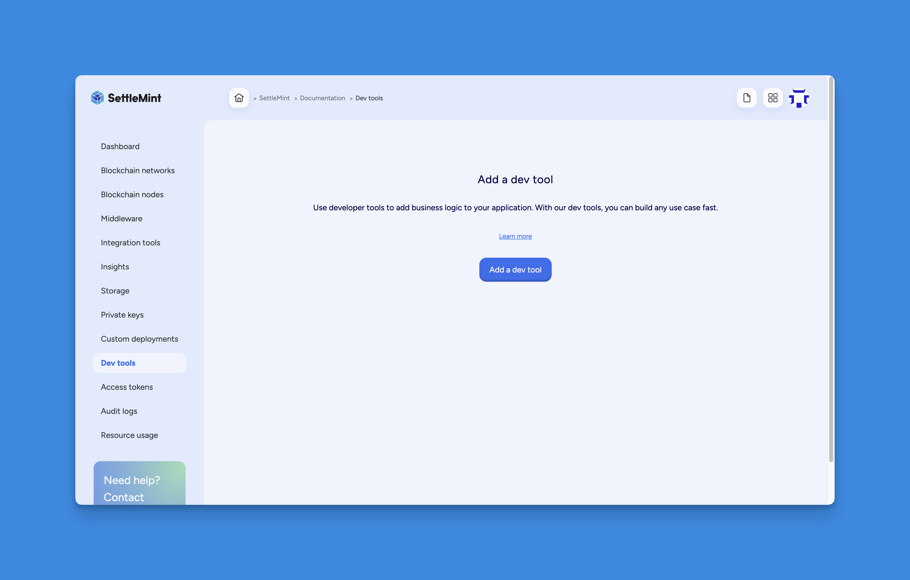
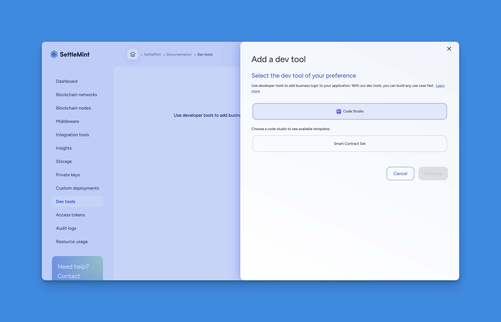
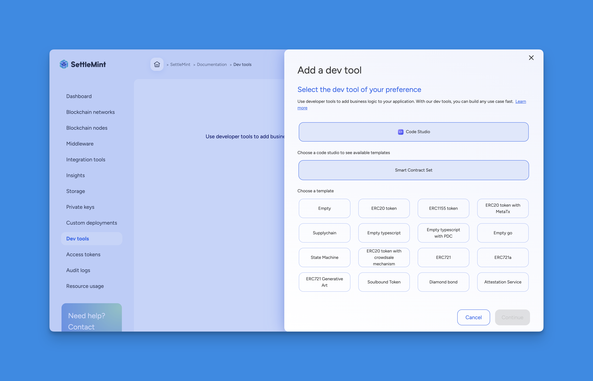
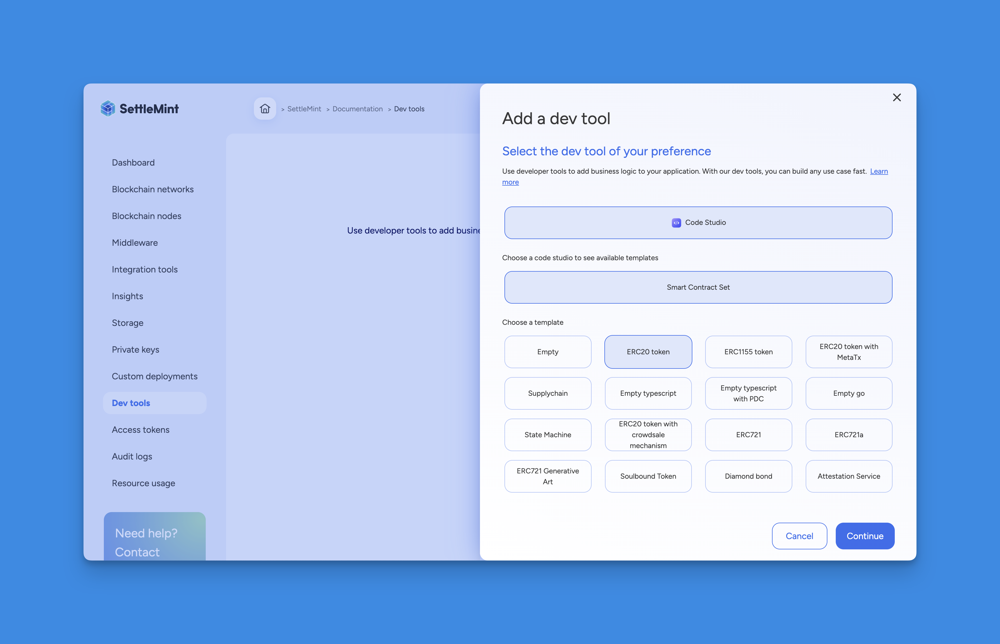
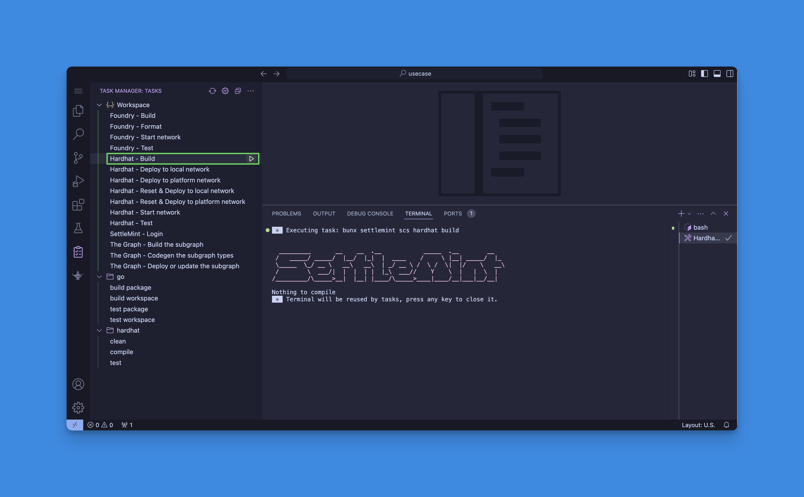
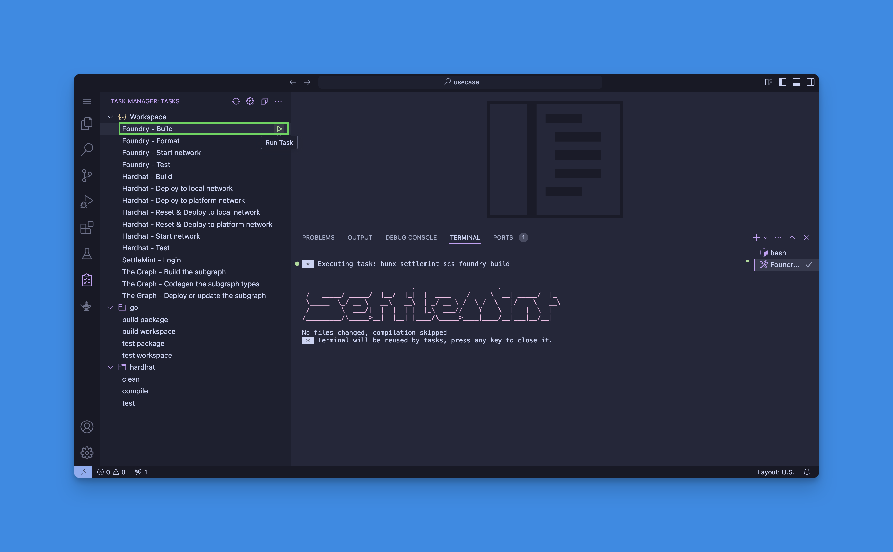
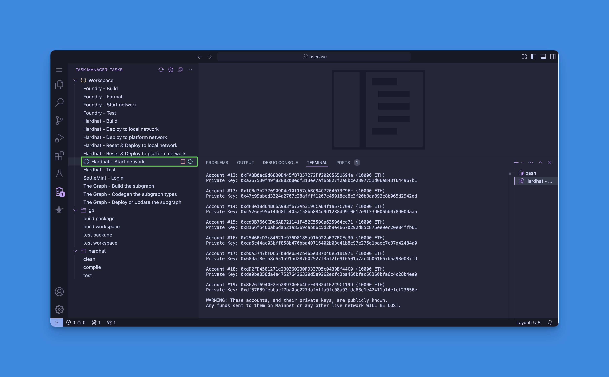

import { Tabs, Tab } from "fumadocs-ui/components/tabs";
import { Callout } from "fumadocs-ui/components/callout";
import { Steps } from "fumadocs-ui/components/steps";
import { Card } from "fumadocs-ui/components/card";

## How to setup code studio and deploy smart contracts on SettleMint platform

The Code Studio is a web-based Visual Studio Code IDE. It offers a comprehensive toolset for building decentralized applications (dApps), including pre-configured extensions and a seamless GitHub integration. With the built-in SettleMint SDK Command Line Interface (CLI), you can easily use platform services directly from within the Code Studio, making it easier to build your dApp.

Smart contract sets allow you to incorporate **business logic** into your
application by deploying smart contracts that run on the blockchain. You can add
a smart contract set via different methods as part of your development workflow.

<Callout type="info">
  You must have an existing application before you add a smart contract set.
</Callout>

<Tabs items={['Platform UI', 'SDK CLI', 'SDK JS']}>
  <Tab value="Platform UI">
    <Steps>
      ### Navigate to Application
      Navigate to the **application** where you want to add the smart contract set.

      ### Open Dev Tools
      Open **Dev tools** and click on **Add a Dev tool**.

      

      ### Select Code Studio
      Select **Code Studio** as the Dev tool type.

      

      ### Choose Smart Contract Set
      Then choose **Smart Contract Set**.

      

      ### Pick a Template
      Pick a **template**; the Code Studio will load with your chosen smart contract template.

      

      ### Enter Details
      Click **Continue** to enter details such as the Dev tool name, user, and deployment plan.

      

      ### Confirm
      Confirm the resource cost and click **Confirm** to add the smart contract set.
    </Steps>

    You can now further configure and eventually deploy your smart contracts.

  </Tab>

  <Tab value="SDK CLI">
    First, ensure you are authenticated:

    ```bash
    settlemint login
    ```

    You can create a smart contract set either on the platform or locally:

    ### Create on Platform

    Then create a smart contract set with the following command (refer to the
    [CLI docs](/building-with-settlemint/15_dev-tools/1_SDK.md) for more details):

    ```bash
    settlemint platform create smart-contract-set <tool-name> \
      --application <application-name> \
      --template <template-name> \
      --deployment-plan <deployment-plan>
    ```

    For example:

    ```bash
    settlemint platform create smart-contract-set my-scset \
      --application my-app \
      --template default \
      --deployment-plan starter
    ```

    ### Working with Smart Contract Sets Locally

    You can also work with smart contract sets in your local development environment. This is useful for development and testing before deploying to the platform.

    To create a smart contract set locally:

    ```bash
    # Create a new smart contract set
    settlemint scs create

    # You'll see the SettleMint ASCII art and then be prompted:
    ✔ What is the name of your new SettleMint project? my awesome project

    # Choose from available templates:
    ❯ ERC20 token
      Empty typescript
      Empty typescript with PDC
      ERC1155 token
      ERC20 token with crowdsale mechanism
      ERC20 token with MetaTx
      ERC721
      # ... and more
    ```

    Once created, you can use these commands to work with your local smart contract set:

    ```bash
    settlemint scs -h  # Show all available commands

    # Main commands:
    settlemint scs create        # Create a new smart contract set
    settlemint scs foundry      # Foundry commands for building and testing
    settlemint scs hardhat      # Hardhat commands for building, testing and deploying
    settlemint scs subgraph    # Commands for managing TheGraph subgraphs
    ```

    The scaffolded project includes everything you need to start developing smart contracts:
    - Contract templates
    - Testing framework
    - Deployment scripts
    - Development tools configuration

    ### Managing Platform Smart Contract Sets

    Manage your platform smart contract sets with:

    ```bash
    # List smart contract sets
    settlemint platform list smart-contract-sets --application <application-name>

    # Read smart contract set details
    settlemint platform read smart-contract-set <smart-contract-set-name>

    # Delete a smart contract set
    settlemint platform delete smart-contract-set <smart-contract-set-name>
    ```

  </Tab>

  <Tab value="SDK JS">
    You can also add a smart contract set programmatically using the JS SDK. The API follows the same pattern as for applications and blockchain networks:

    ```typescript
    import { createSettleMintClient } from '@settlemint/sdk-js';

    const client = createSettleMintClient({
      accessToken: process.env.SETTLEMENT_ACCESS_TOKEN!,
      instance: 'https://console.settlemint.com'
    });

    // Create a Smart Contract Set
    const createSmartContractSet = async () => {
      const result = await client.smartContractSet.create({
        applicationUniqueName: "your-app",        // Your application unique name
        name: "my-smart-contract-set",            // The smart contract set name
        template: "default"                       // Template to use (choose from available templates)
      });
      console.log('Smart Contract Set created:', result);
    };

    // List Smart Contract Sets
    const listSmartContractSets = async () => {
      const sets = await client.smartContractSet.list("your-app");
      console.log('Smart Contract Sets:', sets);
    };

    // Read Smart Contract Set details
    const readSmartContractSet = async () => {
      const details = await client.smartContractSet.read("smart-contract-set-unique-name");
      console.log('Smart Contract Set details:', details);
    };

    // Delete a Smart Contract Set
    const deleteSmartContractSet = async () => {
      await client.smartContractSet.delete("smart-contract-set-unique-name");
      console.log('Smart Contract Set deleted');
    };
    ```

    <Callout type="tip">
    Get your access token from the Platform UI under **User Settings → API Tokens**.
    </Callout>

  </Tab>
</Tabs>

<Callout type="info">
  All operations require that you have the necessary permissions in your
  workspace.
</Callout>

For protocol-specific information, please refer to the relevant section in our
blockchain guides:

- [Hyperledger Besu Smart Contracts IDE](/blockchain-guides/hyperledger-besu/integration-tools)
- [Ethereum Smart Contracts IDE](/blockchain-guides/ethereum/integration-tools)
- [Avalanche Smart Contracts IDE](/blockchain-guides/avalanche/integration-tools)
- [Polygon Smart Contracts IDE](/blockchain-guides/polygon/integration-tools)
- [Hyperledger Fabric Smart Contracts IDE](/blockchain-guides/hyperledger-fabric/integration-tools)

## Deploying Smart Contracts

You can deploy your contracts to a network in the platform or a local
development network. This guide covers both Platform UI and SDK CLI approaches.

<Tabs items={['Platform UI', 'SDK CLI']}>
  <Tab value="Platform UI">
    Follow these steps to deploy your smart contract through the Platform UI:

    1. Open the IDE by clicking on your smart contract set.

       

    2. Click on the **Task Manager** button.

       

    3. First compile your contract by running either:
       - **Hardhat - Build** task
         
       - **Foundry - Build** task
         

    4. To deploy to a platform network:
       - Run the **SettleMint - Login** task
         
       - Run the **Hardhat - Deploy to platform network** task
         
       - Select your node and private key when prompted
         

    5. To deploy locally:
       - Run the **Hardhat - Start local network** task
         
       - Run the **Hardhat - Deploy to local network** task
         

  </Tab>

  <Tab value="SDK CLI">
    ## Prerequisites

    First, authenticate yourself and connect to your application:

    ```bash
    # Login to the platform
    settlemint login

    # Connect to your application
    settlemint connect
    ```

    ## Using Hardhat

    Hardhat provides a complete development environment. Here's how to use it:

    ```bash
    # Step 1: Build your smart contracts
    settlemint scs hardhat build

    # Step 2: Choose your deployment target
    # For local development:
    settlemint scs hardhat network     # Start a local network
    settlemint scs hardhat deploy local  # Deploy to local network

    # For production:
    settlemint scs hardhat deploy remote  # Deploy to platform network

    # Development tools:
    settlemint scs hardhat test    # Run your test suite
    settlemint scs hardhat script  # Execute deployment scripts
    ```

    ## Using Foundry

    Foundry offers fast compilation and testing. Here's how to use it:

    ```bash
    # Step 1: Build your smart contracts
    settlemint scs foundry build

    # Step 2: Test and format
    settlemint scs foundry test    # Run your test suite
    settlemint scs foundry format  # Format your contract code

    # Step 3: Local development
    settlemint scs foundry network  # Start a local network for testing
    ```

    ## Working with Subgraphs

    If you need to index your smart contract data:

    ```bash
    # Step 1: Generate TypeScript types from your schema
    settlemint scs subgraph codegen

    # Step 2: Build the subgraph
    settlemint scs subgraph build

    # Step 3: Deploy to the Graph node
    settlemint scs subgraph deploy [subgraph-name]
    ```

    <Callout type="info">
    Before deployment, ensure:
    - You're authenticated (`settlemint login`)
    - You're connected to your application (`settlemint connect`)
    - Your smart contracts are compiled
    - For remote deployment: you have a running node and sufficient funds
    </Callout>

    ### Environment Configuration

    When using `settlemint connect`, you'll be prompted to configure:
    - Workspace selection
    - Application selection
    - Blockchain node selection
    - The Graph instance selection
    - HD Private Key selection
    - Application access token creation

    This configuration is stored locally and used for subsequent commands.

  </Tab>
</Tabs>

## Project Structure

The typical folder structure of a SettleMint smart contract set includes:

- **`contracts/`**: Contains the Solidity smart contracts
- **`test/`**: Contains both Hardhat (TypeScript) and Foundry (Solidity) tests
- **`script/`**: Deployment and interaction scripts
- **`lib/`**: Optional Solidity libraries
- **`ignitions/`**: Hardhat deployment configurations
- **`out/`**: Compilation artifacts
- **`foundry.toml`**: Foundry configuration
- **`hardhat.config`**: Hardhat configuration
- **`subgraphs/`**: The Graph indexing configurations

## Customize smart contracts

You can customize your smart contracts using the built-in IDE. The smart
contract sets include a Generative AI plugin to assist with development.
[Learn more about the AI plugin here.](./ai-plugin)

## Smart contract template library

SettleMint's smart contract templates serve as open-source, ready-to-use
foundations for blockchain application development, significantly accelerating
the deployment process. These templates enable users to quickly customize and
extend their blockchain applications, leveraging tested and community-enhanced
frameworks to reduce development time and accelerate market entry.

## Open-Source Smart Contract Templates under the MIT License

Benefit from the expertise of the blockchain community and trust in the
reliability of your smart contracts. These templates are vetted and used by
major enterprises and institutions, ensuring enhanced security and confidence in
your deployments.

## Template library

The programming languages for smart contracts differ depending on the protocol.
For blockchain networks that are EVM (Ethereum Virtual Machine) compatible, the
programming language used is Solidity. For Hyperledger Fabric, the programming
languages used are TypeScript and Go.

- [Empty](https://github.com/settlemint/solidity-empty)

- [ERC20 token](https://github.com/settlemint/solidity-token-erc20)

- [ERC1155 token](https://github.com/settlemint/solidity-token-erc1155)

- [ERC20 token with MetaTx](https://github.com/settlemint/solidity-token-erc20-metatx)

- [Supplychain](https://github.com/settlemint/solidity-supplychain)

- [Empty typescript](https://github.com/settlemint/chaincode-typescript-empty)

- [Empty typescript with PDC](https://github.com/settlemint/chaincode-typescript-empty-pdc)

- [Empty go](https://github.com/settlemint/chaincode-go-empty)

- [State Machine](https://github.com/settlemint/solidity-statemachine)

- [ERC20 token with crowdsale mechanism](https://github.com/settlemint/solidity-token-erc20-crowdsale)

- [ERC721](https://github.com/settlemint/solidity-token-erc721)

- [ERC721a](https://github.com/settlemint/solidity-token-erc721a)

- [ERC721 Generative Art](https://github.com/settlemint/solidity-token-erc721-generative-art)

- [Soulbound Token](https://github.com/settlemint/solidity-token-soulbound)

- [Diamond bond](https://github.com/settlemint/solidity-diamond-bond)

- [Attestation Service](https://github.com/settlemint/solidity-attestation-service)

## Create Your Own Smart Contract Templates for Your Consortium

Within the self-managed Blockchain Transformation Platform (BTP), you can create
and add your own templates for use within your consortium. This fosters a
collaborative environment where templates can be reused and built upon,
promoting innovation and efficiency within your network.

To get started, visit:
[SettleMint GitHub Repository](https://github.com/settlemint/solidity-empty)