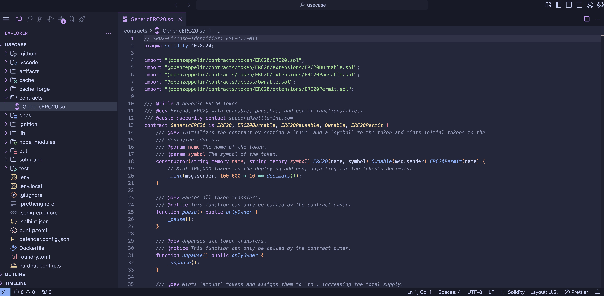
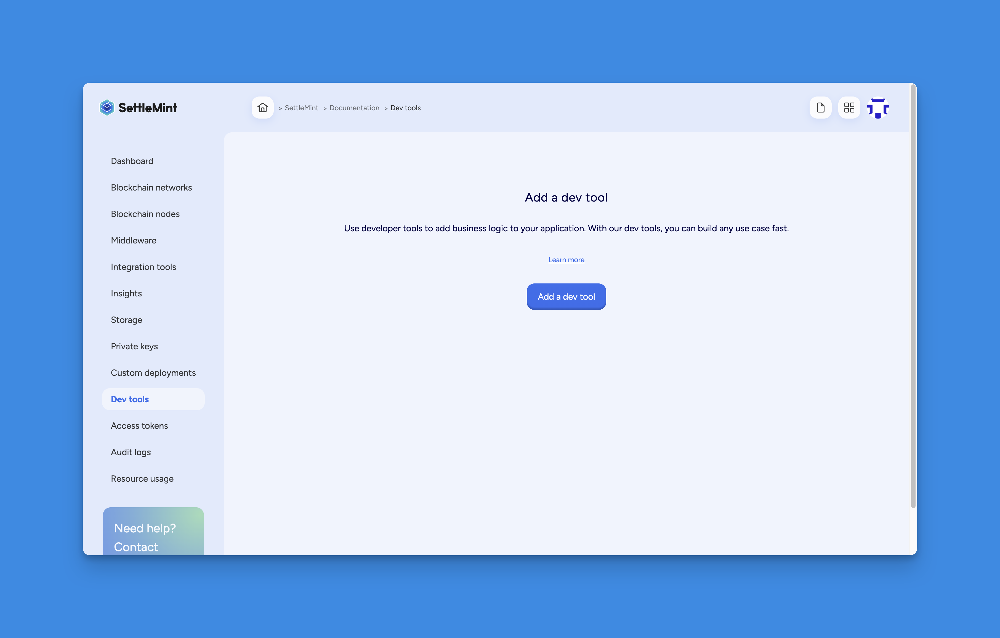
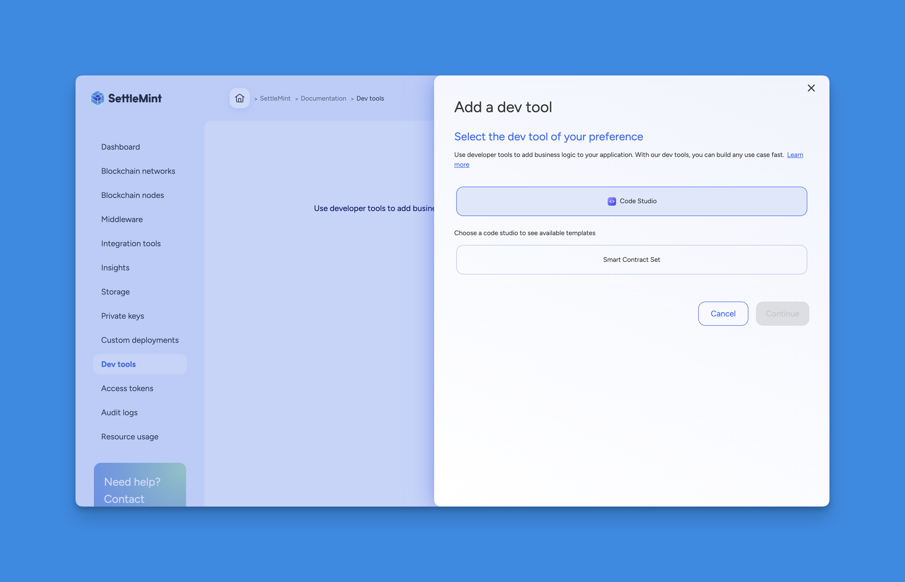
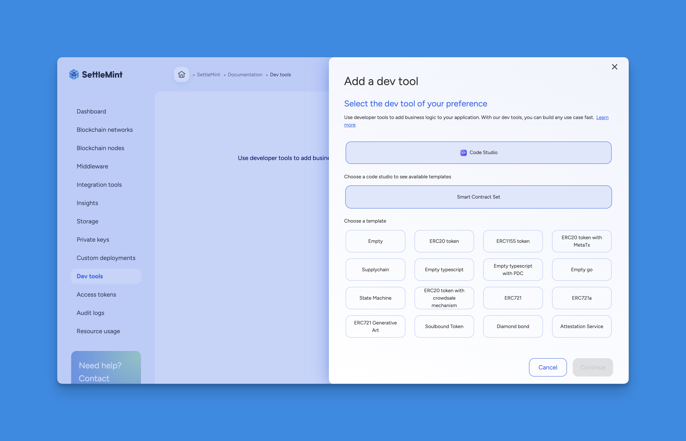

import { Tabs, Tab } from "fumadocs-ui/components/tabs";
import { Callout } from "fumadocs-ui/components/callout";
import { Steps } from "fumadocs-ui/components/steps";
import { Card } from "fumadocs-ui/components/card";

<div style={{
  backgroundColor: "#e1eafd", 
  color: "#356fee", 
  padding: "0.5px 10px 10px 10px",
  borderRadius: "10px", 
  fontSize: "18px", 
  fontWeight: "bold",
  lineHeight: "1.2",
  textAlign: "left"
}}>
  Summary  
  <div style={{ fontSize: "16px", fontWeight: "normal", marginTop: "5px" }}>

</div>
</div>


## How to setup code studio and deploy smart contracts on SettleMint platform

The Code Studio is a web-based Visual Studio Code IDE. It offers a comprehensive toolset for building decentralized applications (dApps), including pre-configured extensions and a seamless GitHub integration. With the built-in SettleMint SDK Command Line Interface (CLI), you can easily use platform services directly from within the Code Studio, making it easier to build your dApp.




Smart contract sets allow you to incorporate **business logic** into your
application by deploying smart contracts that run on the blockchain. You can add
a smart contract set via different methods as part of your development workflow.

## EVM IDE Project Structure

| Folder             | Description                                                                                      |
|--------------------|--------------------------------------------------------------------------------------------------|
| `contracts/`       | Contains Solidity smart contracts that define the core logic and business rules of the dApp.     |
| `test/`            | Holds test files. These can be written in **TypeScript** for Hardhat or **Solidity** for Foundry.|
| `script/`          | Stores deployment and interaction scripts, often used to automate tasks like contract deployment.|
| `lib/`             | Optional directory for external Solidity libraries or reusable modules to avoid code repetition. |
| `ignitions/`       | Contains **Hardhat Ignition** configuration for defining declarative deployment plans.           |
| `out/`             | Output folder used by **Foundry**, containing compiled contract artifacts like ABIs and bytecode.|
| `artifacts/`       | Output folder used by **Hardhat**, similar to `out/`, containing build artifacts and metadata.   |
| `subgraphs/`       | Contains files for **The Graph** integration—schema, mappings, and manifest for data indexing.   |
| `cache/`           | Caching directory for Hardhat to improve build performance by avoiding redundant compilation.    |
| `cache_forge/`     | Caching directory for Foundry to speed up compilation and reuse outputs.                         |
| `node_modules/`    | Contains installed npm packages and dependencies used in Hardhat or other JS-based tools.        |

## Code Studio IDE Task Manager

The **Code Studio IDE Task Manager** provides a structured set of scripts and tasks to streamline your smart contract project lifecycle—from development and testing, to deployment and indexing. Below is a categorized table of tasks with concise explanations.

| Task                                         | Tool           | Description                                                                 |
|----------------------------------------------|----------------|-----------------------------------------------------------------------------|
| SettleMint - Login                           | SettleMint CLI | Logs into the SettleMint platform via CLI for authenticated deployments.   |
| Foundry - Build                              | Foundry        | Compiles the smart contracts using Foundry.                                 |
| Hardhat - Build                              | Hardhat        | Compiles the smart contracts using Hardhat.                                 |
| Foundry - Test                               | Foundry        | Runs tests using Foundry’s native testing framework.                        |
| Hardhat - Test                               | Hardhat        | Executes tests using Hardhat's JavaScript-based test suite.                |
| Foundry - Format                             | Foundry        | Formats smart contract code for readability (optional).                     |
| Foundry - Start network                      | Foundry        | Starts a local Foundry testnet environment.                                 |
| Hardhat - Start network                      | Hardhat        | Starts a local Hardhat network for JS-based testing.                        |
| Hardhat - Deploy to local network            | Hardhat        | Deploys compiled contracts to the local Hardhat network.                    |
| Hardhat - Reset & Deploy to local network    | Hardhat        | Resets the local chain state and redeploys contracts.                       |
| Hardhat - Deploy to platform network         | Hardhat        | Deploys contracts to a blockchain network hosted on SettleMint.            |
| Hardhat - Reset & Deploy to platform network | Hardhat        | Resets the platform network state and redeploys contracts.                 |
| The Graph - Codegen the subgraph types       | The Graph CLI  | Generates TypeScript types based on subgraph GraphQL schema.               |
| The Graph - Build the subgraph               | The Graph CLI  | Compiles the subgraph for deployment to The Graph.                          |
| The Graph - Deploy or update the subgraph    | The Graph CLI  | Deploys or updates the subgraph on The Graph's hosted service.             |


When using Hardhat Ignition for deploying smart contracts, the deployed contract addresses are stored in the file
ignition/deployments/chain-CHAIN_ID/deployed_addresses.json.
This file serves as a reliable reference for all contracts deployed on a specific network.
It maps contract names to their respective blockchain addresses, making it easy to retrieve addresses later for interactions, frontend integrations, or upgrades.


<Callout type="info">
  You must have an existing application before you add a smart contract set.
</Callout>

## How to add code studio

<Tabs items={['Platform UI', 'SDK CLI', 'SDK JS']}>
  <Tab value="Platform UI">
    <Steps>
      ### Navigate to Application
      Navigate to the **application** where you want to add the smart contract set.

      ### Open Dev Tools
      Open **Dev tools** and click on **Add a Dev tool**.

      

      ### Select Code Studio
      Select **Code Studio** as the Dev tool type.

      

      ### Choose Smart Contract Set
      Then choose **Smart Contract Set**.

      

      ### Pick a Template
      Pick a **template**; the Code Studio will load with your chosen smart contract template.

      

      ### Enter Details
      Click **Continue** to enter details such as the Dev tool name, user, and deployment plan.

      

      ### Confirm
      Confirm the resource cost and click **Confirm** to add the smart contract set.
    </Steps>

    You can now further configure and eventually deploy your smart contracts.

  </Tab>

  <Tab value="SDK CLI">
    First, ensure you are authenticated:

    ```bash
    settlemint login
    ```

    You can create a smart contract set either on the platform or locally:

    ### Create on Platform

    Then create a smart contract set with the following command (refer to the
    [CLI docs](/building-with-settlemint/15_dev-tools/1_SDK.md) for more details):

    ```bash
    settlemint platform create smart-contract-set <tool-name> \
      --application <application-name> \
      --template <template-name> \
      --deployment-plan <deployment-plan>
    ```

    For example:

    ```bash
    settlemint platform create smart-contract-set my-scset \
      --application my-app \
      --template default \
      --deployment-plan starter
    ```

    ### Working with Smart Contract Sets Locally

    You can also work with smart contract sets in your local development environment. This is useful for development and testing before deploying to the platform.

    To create a smart contract set locally:

    ```bash
    # Create a new smart contract set
    settlemint scs create

    # You'll see the SettleMint ASCII art and then be prompted:
    ✔ What is the name of your new SettleMint project? my awesome project

    # Choose from available templates:
    ❯ ERC20 token
      Empty typescript
      Empty typescript with PDC
      ERC1155 token
      ERC20 token with crowdsale mechanism
      ERC20 token with MetaTx
      ERC721
      # ... and more
    ```

    Once created, you can use these commands to work with your local smart contract set:

    ```bash
    settlemint scs -h  # Show all available commands

    # Main commands:
    settlemint scs create        # Create a new smart contract set
    settlemint scs foundry      # Foundry commands for building and testing
    settlemint scs hardhat      # Hardhat commands for building, testing and deploying
    settlemint scs subgraph    # Commands for managing TheGraph subgraphs
    ```

    The scaffolded project includes everything you need to start developing smart contracts:
    - Contract templates
    - Testing framework
    - Deployment scripts
    - Development tools configuration

    ### Managing Platform Smart Contract Sets

    Manage your platform smart contract sets with:

    ```bash
    # List smart contract sets
    settlemint platform list smart-contract-sets --application <application-name>

    # Read smart contract set details
    settlemint platform read smart-contract-set <smart-contract-set-name>

    # Delete a smart contract set
    settlemint platform delete smart-contract-set <smart-contract-set-name>
    ```

  </Tab>

  <Tab value="SDK JS">
    You can also add a smart contract set programmatically using the JS SDK. The API follows the same pattern as for applications and blockchain networks:

    ```typescript
    import { createSettleMintClient } from '@settlemint/sdk-js';

    const client = createSettleMintClient({
      accessToken: process.env.SETTLEMENT_ACCESS_TOKEN!,
      instance: 'https://console.settlemint.com'
    });

    // Create a Smart Contract Set
    const createSmartContractSet = async () => {
      const result = await client.smartContractSet.create({
        applicationUniqueName: "your-app",        // Your application unique name
        name: "my-smart-contract-set",            // The smart contract set name
        template: "default"                       // Template to use (choose from available templates)
      });
      console.log('Smart Contract Set created:', result);
    };

    // List Smart Contract Sets
    const listSmartContractSets = async () => {
      const sets = await client.smartContractSet.list("your-app");
      console.log('Smart Contract Sets:', sets);
    };

    // Read Smart Contract Set details
    const readSmartContractSet = async () => {
      const details = await client.smartContractSet.read("smart-contract-set-unique-name");
      console.log('Smart Contract Set details:', details);
    };

    // Delete a Smart Contract Set
    const deleteSmartContractSet = async () => {
      await client.smartContractSet.delete("smart-contract-set-unique-name");
      console.log('Smart Contract Set deleted');
    };
    ```

    <Callout type="tip">
    Get your access token from the Platform UI under **User Settings → API Tokens**.
    </Callout>

  </Tab>
</Tabs>

<Callout type="info">
  All operations require that you have the necessary permissions in your
  workspace.
</Callout>


## Customize smart contracts

You can customize your smart contracts using the built-in IDE. The smart
contract sets include a Generative AI plugin to assist with development.
[Learn more about the AI plugin here.](./ai-plugin)

## Smart contract template library

SettleMint's smart contract templates serve as open-source, ready-to-use
foundations for blockchain application development, significantly accelerating
the deployment process. These templates enable users to quickly customize and
extend their blockchain applications, leveraging tested and community-enhanced
frameworks to reduce development time and accelerate market entry.

## Open-Source Smart Contract Templates under the MIT License

Benefit from the expertise of the blockchain community and trust in the
reliability of your smart contracts. These templates are vetted and used by
major enterprises and institutions, ensuring enhanced security and confidence in
your deployments.

## Template library

The programming languages for smart contracts differ depending on the protocol.
For blockchain networks that are EVM (Ethereum Virtual Machine) compatible, the
programming language used is Solidity. For Hyperledger Fabric, the programming
languages used are TypeScript and Go.

- [Empty](https://github.com/settlemint/solidity-empty)

- [ERC20 token](https://github.com/settlemint/solidity-token-erc20)

- [ERC1155 token](https://github.com/settlemint/solidity-token-erc1155)

- [ERC20 token with MetaTx](https://github.com/settlemint/solidity-token-erc20-metatx)

- [Supplychain](https://github.com/settlemint/solidity-supplychain)

- [Empty typescript](https://github.com/settlemint/chaincode-typescript-empty)

- [Empty typescript with PDC](https://github.com/settlemint/chaincode-typescript-empty-pdc)

- [Empty go](https://github.com/settlemint/chaincode-go-empty)

- [State Machine](https://github.com/settlemint/solidity-statemachine)

- [ERC20 token with crowdsale mechanism](https://github.com/settlemint/solidity-token-erc20-crowdsale)

- [ERC721](https://github.com/settlemint/solidity-token-erc721)

- [ERC721a](https://github.com/settlemint/solidity-token-erc721a)

- [ERC721 Generative Art](https://github.com/settlemint/solidity-token-erc721-generative-art)

- [Soulbound Token](https://github.com/settlemint/solidity-token-soulbound)

- [Diamond bond](https://github.com/settlemint/solidity-diamond-bond)

- [Attestation Service](https://github.com/settlemint/solidity-attestation-service)

## Create Your Own Smart Contract Templates for Your Consortium

Within the self-managed Blockchain Transformation Platform (BTP), you can create
and add your own templates for use within your consortium. This fosters a
collaborative environment where templates can be reused and built upon,
promoting innovation and efficiency within your network.

To get started, visit:
[SettleMint GitHub Repository](https://github.com/settlemint/solidity-empty)