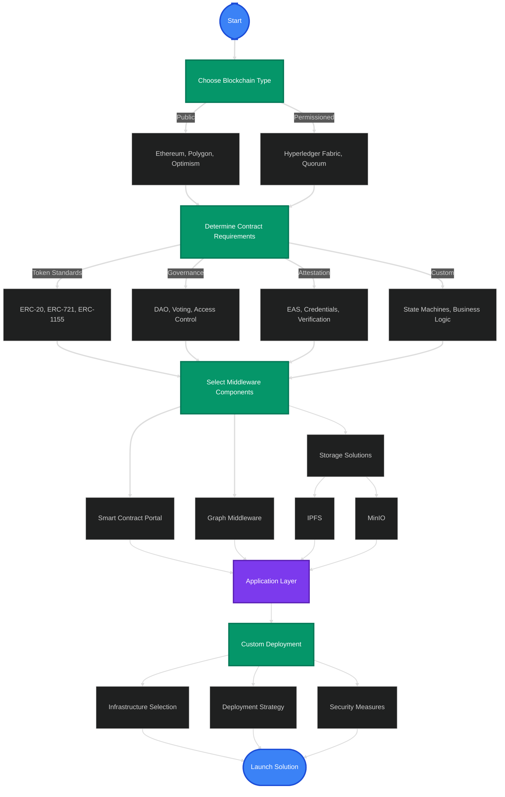

import { Callout } from "fumadocs-ui/components/callout";
import { Card } from "fumadocs-ui/components/card";
import { Steps } from "fumadocs-ui/components/steps";
import { Tab, Tabs } from "fumadocs-ui/components/tabs";

# Application Development Journey on SettleMint

This guide will walk you through the key decisions needed to build an effective
blockchain solution using SettleMint.

## Decision Flow Overview

  <Callout type="info">
    Each decision in your blockchain journey affects performance, security, and
    functionality of your final solution. Follow this guide to make informed
    choices tailored to your specific use case.
  </Callout>

## 1. Blockchain Type

  <Card>
    ### Public Blockchain - Global, permissionless networks - Native token
    economics - Higher transaction costs - Fully transparent - **Networks**:
    Ethereum, Polygon, Optimism, Arbitrum - **Best for**: DeFi, NFTs, public
    applications
  </Card>
  <Card>
    ### Permissioned Blockchain - Controlled access - Enterprise-grade privacy -
    Higher throughput - Lower transaction costs - **Networks**: Hyperledger
    Fabric, Quorum - **Best for**: Enterprise, consortium, regulated industries
  </Card>

## 2. Smart Contract Requirements
<Tabs
  items={[
    "Token Standards",
    "Governance",
    "Attestation Service",
    "Custom Development",
  ]}
>
  <Tab value="Token Standards">
    ### Token Templates - **ERC-20**: Fungible tokens for currencies, voting
    rights - **ERC-721**: Non-fungible tokens for unique assets - **ERC-1155**:
    Multi-token standard for batched operations - **Custom Tokens**: Specialized
    token logic for specific use cases
  </Tab>
  <Tab value="Governance">
    ### Governance Templates - **DAO Frameworks**: Decentralized governance
    structures - **Voting Systems**: On-chain proposal and voting mechanisms -
    **Access Control**: Role-based systems for permissioned operations -
    **Multi-signature**: Enhanced security for critical operations
  </Tab>
  <Tab value="Attestation Service">
    ### Attestation Templates - **EAS Protocol**: Ethereum Attestation Service
    implementation - **Credential Systems**: Verifiable credentials and claims -
    **Reputation Systems**: On-chain reputation and identity - **Verification
    Logic**: Custom verification for attestations
  </Tab>
  <Tab value="Custom Development">
    ### Custom Development - **State Machines**: Event-driven contract logic -
    **Business Logic**: Domain-specific smart contracts - **Integration
    Patterns**: Oracle and external system integrations - **Upgradability
    Patterns**: Future-proof contract architecture
  </Tab>
</Tabs>
## 3. Middleware and Infrastructure

  <Card>
    ### API and Indexing - **Smart Contract Portal**: Complete API layer with
    REST/GraphQL endpoints - **Graph Middleware**: Optimized for complex data
    relationships - **Attestation Indexer**: Specialized for attestation data -
    **FabConnect**: RESTful API for Hyperledger Fabric
  </Card>
  <Card>
    ### Storage Solutions - **IPFS**: Distributed, content-addressed storage -
    **MinIO**: High-performance object storage - **Persistence Considerations**:
    Data availability, redundancy - **Cost Optimization**: On-chain vs.
    off-chain storage strategies
  </Card>

## 4. Analytics and Insights
<Tabs items={["Dashboards", "Monitoring", "Analytics"]}>
  <Tab value="Dashboards">
    ### Dashboard Solutions - **Real-time Metrics**: Transaction volumes,
    contract interactions - **User Activity**: Address activity, interaction
    patterns - **Financial Metrics**: Token flows, value locked - **Custom
    Visualizations**: Domain-specific analytics
  </Tab>
  <Tab value="Monitoring">
    ### System Monitoring - **Node Health**: Performance metrics, sync status -
    **Transaction Monitoring**: Success rates, gas costs - **Alert Systems**:
    Anomaly detection, threshold alerts - **Service Level Monitoring**: API
    response times, availability
  </Tab>
  <Tab value="Analytics">
    ### Advanced Analytics - **Behavioral Analysis**: User patterns and trends -
    **Network Analysis**: Transaction relationships and flows - **Business
    Intelligence**: KPI tracking and reporting - **Predictive Models**:
    Forecasting and trend analysis
  </Tab>
</Tabs>
<Callout type="tip" className="mt-8">
  Remember that your blockchain solution is a holistic system. Each component
  should be selected to work harmoniously with your overall architecture and
  business requirements.
</Callout>
## 5. Custom Deployment
<Tabs items={["Infrastructure", "Deployment Strategy", "Security"]}>
  <Tab value="Infrastructure">
    ### Infrastructure Selection - **Cloud Providers**: AWS, Azure, GCP
    integration options - **On-Premises**: Enterprise deployment configurations
    - **Hybrid Models**: Combined cloud and on-premises solutions -
    **Scalability Planning**: Resource allocation and growth strategies
  </Tab>
  <Tab value="Deployment Strategy">
    ### Deployment Strategy - **CI/CD Pipelines**: Automated deployment
    workflows - **Environment Management**: Dev, staging, production separation
    - **Version Control**: Release management and versioning - **Rollback
    Procedures**: Recovery strategies and safeguards
  </Tab>
  <Tab value="Security">
    ### Security Measures - **Access Controls**: Role-based permissions and
    authentication - **Key Management**: Secure private key storage and rotation
    - **Audit Logging**: Comprehensive activity monitoring - **Compliance
    Tools**: Regulatory requirement implementations
  </Tab>
</Tabs>

## Conclusion

By following this decision-making framework, you can create a well-architected
blockchain solution that meets your specific business needs while leveraging the
full power of the SettleMint platform.
