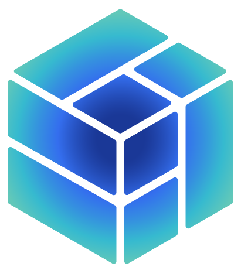

  

    
  

  

    <ul>
      <li>Available as a SaaS platfrom or deploy anywhere - on cloud or on-prem. .</li>
      <li>Full-stack, comprehensive suite of tools, services and guides.</li>
      <li>Learning academy, detailed documentation, customer success team</li>

    </ul>

  

  <h3 className="text-lg font-semibold m-0 leading-normal -mt-3">
    Protocol Guides
  </h3>
  

    Find supported protocols and explore various protocol specific developer guides.

  

  <h3 className="text-lg font-semibold m-0 leading-normal -mt-3">
    Platform Components
  </h3>
  

    Learn about SettleMint Platfrom components and their role in application development journey.

   
  

  <h3 className="text-lg font-semibold m-0 leading-normal -mt-3">
    Deployment options
  </h3>
  

  Learn how you can deploy SettleMint platfrom in cloud environment or on-prem data center of your choice.
  

  <h3 className="text-lg font-semibold m-0 leading-normal -mt-3">
    Knowledge Bank
  </h3>
  

  Understand fundamentals of blockchain, various use-cases, latest happenings and stay current with the technology.
  

## Building on SettleMint

### EVM Chains Guide

  
<a href="/building-with-settlemint/evm-chains-guide/create-an-application">Create An Application</a>

  
<a href="/building-with-settlemint/evm-chains-guide/add-network-and-nodes">Add Network And Nodes</a>

  
<a href="/building-with-settlemint/evm-chains-guide/add-private-keys">Add Private Keys</a>

  
<a href="/building-with-settlemint/evm-chains-guide/setup-code-studio">Setup Code Studio</a>

  
<a href="/building-with-settlemint/evm-chains-guide/deploy-smart-contracts">Deploy Smart Contracts</a>

  
<a href="/building-with-settlemint/evm-chains-guide/setup-api-portal">Setup API Portal</a>

  
<a href="/building-with-settlemint/evm-chains-guide/setup-graph-middleware">Setup Graph Middleware</a>

  
<a href="/building-with-settlemint/evm-chains-guide/setup-offchain-database">Setup Offchain Database</a>

  
<a href="/building-with-settlemint/evm-chains-guide/setup-storage">Setup Storage</a>

  
<a href="/building-with-settlemint/evm-chains-guide/deploy-custom-services">Deploy Custom Services</a>

  
<a href="/building-with-settlemint/evm-chains-guide/integration-studio">Integration Studio</a>

  
<a href="/building-with-settlemint/evm-chains-guide/attestation-indexer">Attestation Indexer</a>

  
<a href="/building-with-settlemint/evm-chains-guide/audit-logs">Audit Logs</a>

### Hyperledger Fabric Guide

  
<a href="/building-with-settlemint/hyperledger-fabric-guide/create-an-application">Create An Application</a>

  
<a href="/building-with-settlemint/hyperledger-fabric-guide/add-network-and-nodes">Add Network And Nodes</a>

  
<a href="/building-with-settlemint/hyperledger-fabric-guide/add-private-keys">Add Private Keys</a>

  
<a href="/building-with-settlemint/hyperledger-fabric-guide/setup-code-studio">Setup Code Studio</a>

  
<a href="/building-with-settlemint/hyperledger-fabric-guide/deploy-chain-code">Deploy Chain Code</a>

  
<a href="/building-with-settlemint/hyperledger-fabric-guide/setup-api-portal">Setup API Portal</a>

  
<a href="/building-with-settlemint/hyperledger-fabric-guide/setup-fabconnect-middleware">Setup Fabconnect Middleware</a>

  
<a href="/building-with-settlemint/hyperledger-fabric-guide/setup-offchain-database">Setup Offchain Database</a>

  
<a href="/building-with-settlemint/hyperledger-fabric-guide/setup-storage">Setup Storage</a>

  
<a href="/building-with-settlemint/hyperledger-fabric-guide/deploy-custom-services">Deploy Custom Services</a>

  
<a href="/building-with-settlemint/hyperledger-fabric-guide/integration-studio">Integration Studio</a>

  
<a href="/building-with-settlemint/hyperledger-fabric-guide/audit-logs">Audit Logs</a>

## Platform Components

### Blockchain Infrastructure

  
<a href="/platform-components/blockchain-infrastructure/network-manager">Network Manager</a>

  
<a href="/platform-components/blockchain-infrastructure/blockchain-nodes">Blockchain Nodes</a>

  
<a href="/platform-components/blockchain-infrastructure/consortium-manager">Consortium Manager</a>

  
<a href="/platform-components/blockchain-infrastructure/transaction-signer">Transaction Signer</a>

  
<a href="/platform-components/blockchain-infrastructure/load-balancer">Load Balancer</a>

  
<a href="/platform-components/blockchain-infrastructure/insights">Insights</a>

  
<a href="/platform-components/blockchain-infrastructure/health-monitoring-tools">Health Monitoring Tools</a>

  
<a href="/platform-components/blockchain-infrastructure/resource-usage">Resource Usage</a>

### Dev Tools

  
<a href="/platform-components/blockchain-infrastructure/dev-tools/code-studio">Code Studio</a>

  
<a href="/platform-components/blockchain-infrastructure/dev-tools/ai-code-assistant">AI Code Assistant</a>

  
<a href="/platform-components/blockchain-infrastructure/dev-tools/sdk">SDK</a>

  
<a href="/platform-components/blockchain-infrastructure/dev-tools/cli">CLI</a>

  
<a href="/platform-components/blockchain-infrastructure/dev-tools/mcp">MCP</a>

### Middleware and APIs

  
<a href="/platform-components/blockchain-infrastructure/middleware-and-api-layer/graph-middleware">Graph Middleware</a>

  
<a href="/platform-components/blockchain-infrastructure/middleware-and-api-layer/smart-contract-api-portal">Smart Contract API Portal</a>

  
<a href="/platform-components/blockchain-infrastructure/middleware-and-api-layer/attestation-indexer">Attestation Indexer</a>

  
<a href="/platform-components/blockchain-infrastructure/middleware-and-api-layer/fabconnect">Fabconnect</a>

  
<a href="/platform-components/blockchain-infrastructure/middleware-and-api-layer/integration-studio">Integration Studio</a>

### Storage and Database

  
<a href="/platform-components/blockchain-infrastructure/database-and-storage/hasura-backend-as-a-service">Hasura Backend As A Service</a>

  
<a href="/platform-components/blockchain-infrastructure/database-and-storage/ipfs-storage">IPFS Storage</a>

  
<a href="/platform-components/blockchain-infrastructure/database-and-storage/s3-storage">S3 Storage</a>

### Security and Authentication

  
<a href="/platform-components/blockchain-infrastructure/seecurity-and-authentication/private-keys">Private Keys</a>

  
<a href="/platform-components/blockchain-infrastructure/seecurity-and-authentication/user-wallets">User Wallets</a>

  
<a href="/platform-components/blockchain-infrastructure/seecurity-and-authentication/personal-access-tokens">Personal Access Tokens</a>

  
<a href="/platform-components/blockchain-infrastructure/seecurity-and-authentication/application-access-tokens">Application Access Tokens</a>

## Knowledge Bank

  
<a href="/knowledge-bank/blockchain-introduction">Blockchain Introduction</a>

  
<a href="/knowledge-bank/public-blockchains">Public Blockchains</a>

  
<a href="/knowledge-bank/private-blockchains">Private Blockchains</a>

  
<a href="/knowledge-bank/blockchain-app-design">Blockchain App Design</a>

  
<a href="/knowledge-bank/smart-contracts">Smart Contracts</a>

  
<a href="/knowledge-bank/solidity">Solidity</a>

  
<a href="/knowledge-bank/subgraphs">Subgraphs</a>

  
<a href="/knowledge-bank/chaincode">Chaincode</a>

  
<a href="/knowledge-bank/keys-and-security">Keys And Security</a>

  
<a href="/knowledge-bank/bfsi-usecases">BFSI Usecases</a>

  
<a href="/knowledge-bank/public-sector-usecases">Public Sector Usecases</a>

  
<a href="/knowledge-bank/industrial-usecases">Industrial Usecases</a>

